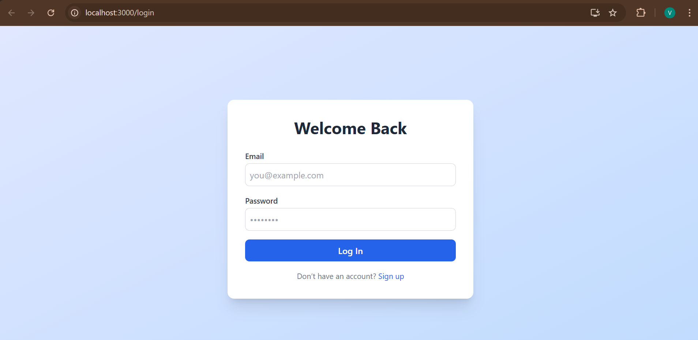
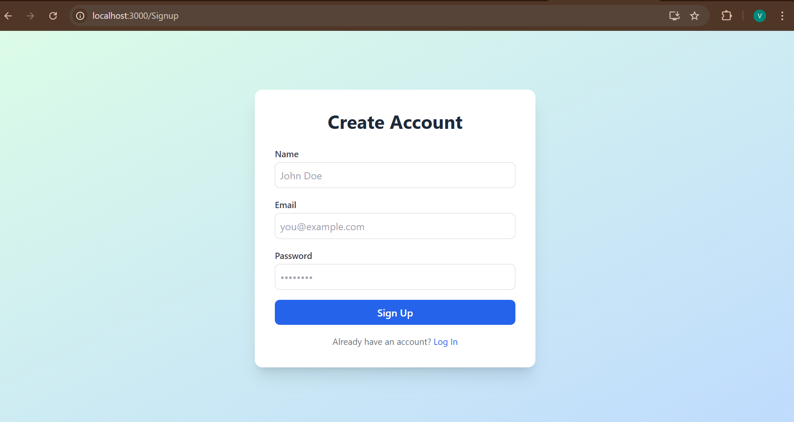
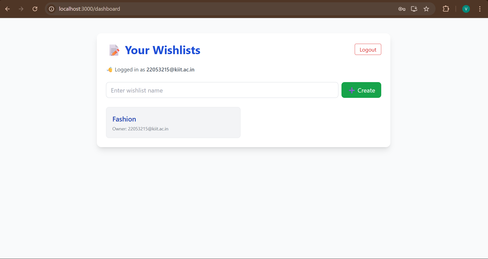
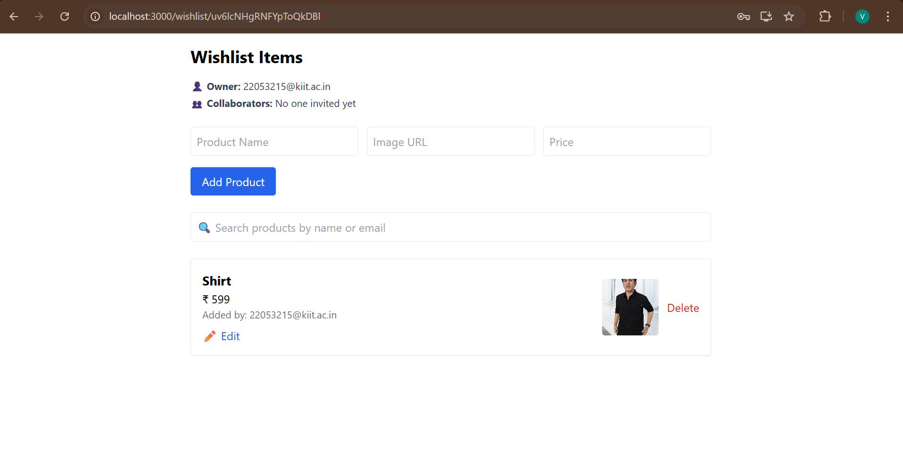

# 📝 Shared Wishlist App

A collaborative wishlist web application where users can create wishlists, add products, invite others (mocked), and track who added what. Built with Firebase and React.

---

## 🔧 Tech Stack

- **Frontend:** React + Tailwind CSS + React Router
- **Backend:** Firebase Firestore + Firebase Auth
- **Database:** Firebase Firestore (NoSQL)
- **Auth:** Firebase Authentication (Email/Password)
- **Realtime Sync:** Firestore Realtime Listeners

---

## 🚀 Setup Instructions

### 1. Clone the Repo
    
    git clone https://github.com/your-username/shared-wishlist-app.git
    cd shared-wishlist-app
### 2. Install Dependencies

    
     npm install

### 3. Set Up Firebase

Create a file at `lib/firebase.js` and add your Firebase config:

     ```js
     import { initializeApp } from "firebase/app";
     import { getAuth } from "firebase/auth";
     import { getFirestore } from "firebase/firestore";
  
     const firebaseConfig = {
     apiKey: "YOUR_API_KEY",
     authDomain: "your-app.firebaseapp.com",
    projectId: "YOUR_PROJECT_ID",
    // ...other keys
    };

    const app = initializeApp(firebaseConfig);
    export const auth = getAuth(app);
    export const db = getFirestore(app);

### 3. Set Up Firebase
      npm run dev/ npm start
---

### 📸 Screenshots

#### 🖥️ Home Page


#### 📋 SignUp View


#### 🔧 Add Wishlist Modal

#### 🔧 Add Wishlist Modal Products



---

### 📌 Assumptions & Limitations

- 🔒 **Invite feature is mocked** – does not send real emails.
- 👥 **Any participant can add/edit/delete items** – no roles or permissions implemented.
- 📷 **Only image URLs supported** – no image file upload yet.
- 🔐 **No password reset or email verification** – basic Firebase Auth only.
- 🧪 **No unit or integration tests** – testing not included in this version.
- 🌐 **App is not deployed** – must be run locally.
---

### 📈 How to Scale / Improve

- ✉️ **Integrate real invite via email** – use Firebase Cloud Functions to send invites.
- 🖼 **Enable image upload** – integrate Firebase Storage for uploading product images.
- 👮 **Add role-based permissions** – support roles like Owner, Editor, Viewer.
- 💬 **Add comments or emoji reactions** – allow users to react or discuss items.
- 🔔 **Add push/email notifications** – notify users on wishlist updates.
- 🧾 **Add pagination or virtual scroll** – improve performance for large lists.
- 🌍 **Deploy the app** – host on Vercel, Netlify, or Firebase Hosting.
- 📲 **Convert to a Progressive Web App (PWA)** – make it installable and offline-capable.
- 🔎 **Add advanced search & filters** – improve discoverability of products.
---

### 🙋‍♂️ Author

- **Name:** Vishal Kashyap  
- **GitHub:** [github.com/vishalsiingh](https://github.com/vishalsiingh)  
- **Email:** [singhvishalk165@gmail.com](mailto:singhvishalk165@gmail.com)
### ⭐ Star the Repo

If you found this project useful, consider giving it a ⭐ on GitHub!

---
            
